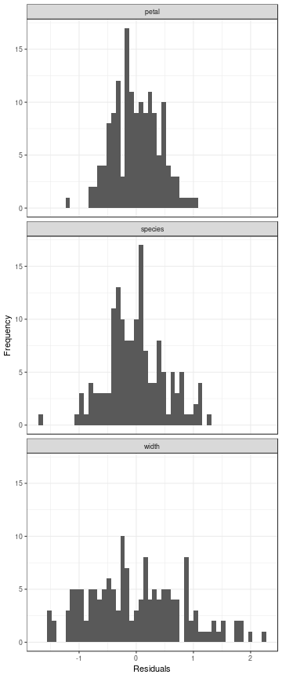

# Intro to `dredger`

Welcome to the quick rundown of the `dredger` package! This package is a small collection of functions I wrote to expedite fitting and comparing multiple models using AIC as a means of exploratory data analysis.

Here I will use a toy example using the `iris` dataset to showcase the main functions provided by `dredger`. To see the code explained and built from the ground up, please check out the repository where I originally posted this code [here](https://github.com/STAT545-UBC-students/hw06-shreeramsenthi/blob/master/purrr-exercise.md).

## Build a List of Formulas

Before we begin, we have to manually build a named list of the formulas we want to test. For example, let's build a list of formulas to model sepal length in the `iris` dataset.


```r
formulas <- list(
  width = Sepal.Length ~ Sepal.Width,
  petal = Sepal.Length ~ Petal.Length + Petal.Width,
  species = Sepal.Length ~ Species
)
```

## Build and Summarize Model Objects

Now we can easily build a list of model objects using the `build_model_objects` function.


```r
linear_models <- build_model_objects(formulas, data = iris)
```

The default behaviour is to make a list of linear model objects, but any function that produces model objects can be passed to the function along with any other relevant arguments. For example, if we had a reason to believe that the dependent variables fit an inverse gaussian distribution, we could build a list of generalized linear models instead like so.


```r
gl_models <- build_model_objects(formulas, data = iris, model = glm, family = inverse.gaussian)
```

Notice that the `family` argument are being passed to the `glm` function.

Now we can use the `sumarize_models` and `summarize_aic` functions to get some information about the list of model objects we've produced.


```r
summarize_models(linear_models)
```

### Anova tables: 
#### width

|term        |sumsq |df  |statistic |p.value |
|:-----------|:-----|:---|:---------|:-------|
|Sepal.Width |1.41  |1   |2.07      |0.152   |
|Residuals   |101   |148 |NA        |NA      |

#### petal

|term         |sumsq |df  |statistic |p.value  |
|:------------|:-----|:---|:---------|:--------|
|Petal.Length |9.93  |1   |61.2      |9.41e-13 |
|Petal.Width  |0.644 |1   |3.97      |0.0483   |
|Residuals    |23.9  |147 |NA        |NA       |

#### species

|term      |sumsq |df  |statistic |p.value  |
|:---------|:-----|:---|:---------|:--------|
|Species   |63.2  |2   |119       |1.67e-31 |
|Residuals |39    |147 |NA        |NA       |

### Confidence Intervals for Coefficients: 
#### width

|2.5 % |97.5 % |
|:-----|:------|
|5.58  |7.47   |
|-0.53 |0.0831 |

#### petal

|2.5 %  |97.5 %   |
|:------|:--------|
|4      |4.38     |
|0.405  |0.679    |
|-0.637 |-0.00246 |

#### species

|2.5 % |97.5 % |
|:-----|:------|
|4.86  |5.15   |
|0.727 |1.13   |
|1.38  |1.79   |

```r
summarize_aic(linear_models) %>%
  kable
```


|model   |      aic| delta_aic| likelihood| aic_weight|
|:-------|--------:|---------:|----------:|----------:|
|width   | 371.9917| 213.94486|          0|          0|
|petal   | 158.0468|   0.00000|          1|          1|
|species | 231.4520|  73.40514|          0|          0|

From this we can see that the two petal measurements together are the most informative model of the three we tested. We can also see the confidence intervals for the parameter estimates for all coefficients.

Of course, we can do this with the list of generalized linear models as well.


```r
summarize_models(gl_models)
```

### Anova tables: 
#### width

|term        |statistic |df |p.value |
|:-----------|:---------|:--|:-------|
|Sepal.Width |2.07      |1  |0.15    |

#### petal

|term         |statistic |df |p.value  |
|:------------|:---------|:--|:--------|
|Petal.Length |80.5      |1  |2.92e-19 |
|Petal.Width  |2.38      |1  |0.123    |

#### species

|term    |statistic |df |p.value  |
|:-------|:---------|:--|:--------|
|Species |270       |2  |2.97e-59 |

### Confidence Intervals for Coefficients: 

```
#> Waiting for profiling to be done...
#> Waiting for profiling to be done...
#> Waiting for profiling to be done...
```

#### width

|2.5 %     |97.5 %  |
|:---------|:-------|
|0.013     |0.0319  |
|-0.000815 |0.00534 |

#### petal

|2.5 %     |97.5 %   |
|:---------|:--------|
|0.0458    |0.0496   |
|-0.00629  |-0.00405 |
|-0.000549 |0.00463  |

#### species

|2.5 %   |97.5 %   |
|:-------|:--------|
|0.0382  |0.0417   |
|-0.0137 |-0.00934 |
|-0.019  |-0.0148  |

```r
summarize_aic(gl_models) %>%
  kable
```


|model   |      aic| delta_aic| likelihood| aic_weight|
|:-------|--------:|---------:|----------:|----------:|
|width   | 367.7181| 231.02068|          0|          0|
|petal   | 136.6974|   0.00000|          1|          1|
|species | 216.6666|  79.96913|          0|          0|

## Visualization

Although no functions specifically for visualizing output are provided, the `tidy_predictions` function returns the dataset augmented with predictions and residuals from each model. The returned dataset is tidy, with a single column for each of the fitted values and another column indicating which model the prediction comes from. This makes it easy to pipe this dataset into `ggplot`'s to visualize predictions and residuals from multiple models with relative ease. For example:


```r
linear_models %>%
  tidy_predictions %>%
  head
#> # A tibble: 6 x 13
#>   Sepal.Length Sepal.Width .fitted .se.fit .resid    .hat .sigma .cooksd
#>          <dbl>       <dbl>   <dbl>   <dbl>  <dbl>   <dbl>  <dbl>   <dbl>
#> 1          5.1         3.5    5.74  0.0962 -0.644 0.0136   0.826 0.00426
#> 2          4.9         3      5.86  0.0680 -0.956 0.00678  0.824 0.00462
#> 3          4.7         3.2    5.81  0.0709 -1.11  0.00739  0.823 0.00680
#> 4          4.6         3.1    5.83  0.0677 -1.23  0.00673  0.822 0.00763
#> 5          5           3.6    5.72  0.108  -0.722 0.0171   0.826 0.00677
#> 6          5.4         3.9    5.66  0.147  -0.255 0.0318   0.828 0.00162
#> # ... with 5 more variables: .std.resid <dbl>, model_name <chr>,
#> #   Petal.Length <dbl>, Petal.Width <dbl>, Species <fct>

linear_models %>%
  tidy_predictions %>%
  ggplot(aes(.resid)) +
    geom_histogram(bins = 50) +
    facet_wrap(~model_name, ncol = 1) +
    theme_bw() +
    labs(x = "Residuals", y = "Frequency")
```



